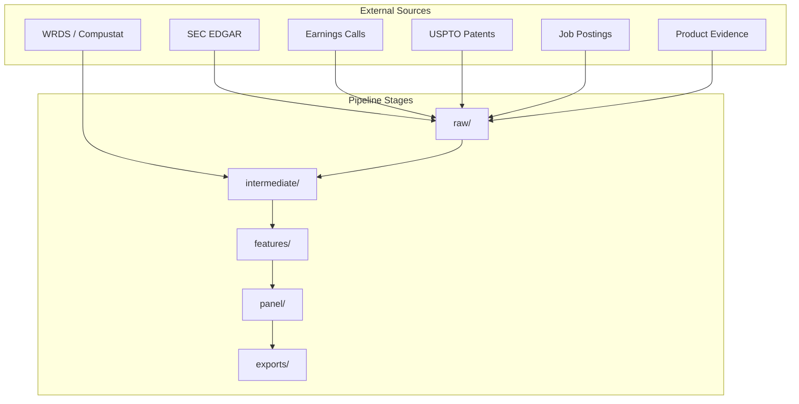

# Architecture

## Overview

The Organizational AI Adaptation Observatory is research infrastructure — analogous to WRDS or Compustat. It collects structured evidence about organizational AI activity without defining what "adaptation" means theoretically.

## Design Principles

1. **Theory agnostic** — No constructs, indices, or latent variables
2. **Signal layers** — Three orthogonal evidence categories
3. **Staged pipeline** — Raw → Intermediate → Features → Panel → Exports
4. **Reproducible** — Config-driven, never overwrites raw data
5. **Extensible** — New sources plug into existing interfaces

## Signal Layers

| Layer | Question | Examples | Output |
|-------|----------|----------|--------|
| **Attention** | What does the organization discuss? | SEC filings, earnings calls | Firm-year mention counts |
| **Investment** | What does the organization invest in? | Patents, job postings | Firm-year investment events |
| **Deployment** | What does the organization ship? | Product launches, APIs | Firm-year deployment events |

## Data Flow



## Module Structure

```
src/oaa_observatory/
├── config/           # Settings, TOML/YAML loading, Pydantic models
├── entity_resolution/ # GVKEY, CIK, ticker → canonical firm_id
├── ingestion/        # BasePipeline abstract class
├── sec/              # Attention: SEC filings
├── earnings_calls/   # Attention: call transcripts
├── patents/          # Investment: AI patents
├── jobs/             # Investment: AI job postings
├── products/         # Deployment: product evidence
├── nlp/              # Keyword counting (not sentiment)
├── preprocessing/    # Text normalization
├── feature_engineering/ # Shared aggregation utilities
├── panel_builder/    # Firm-year panel assembly
├── quality_checks/   # Data validation
├── wrds/             # WRDS client wrapper
└── utils/            # I/O, DuckDB, logging
```

## Entity Resolution

All data sources map to a canonical `firm_id` (format: `OAA-{hash}`).

Priority order for ID generation:
1. GVKEY (Compustat)
2. CIK (SEC)
3. CUSIP
4. PERMNO (CRSP)
5. Ticker
6. Company name (fallback)

Researchers join external datasets using any supported identifier.

## Extension Points

To add a new data source:

1. Create config in `configs/datasources/`
2. Subclass `BasePipeline` in a new module
3. Implement `ingest()`, `standardize()`, `extract_features()`
4. Register in CLI `pipeline_map`
5. Add feature table to `panel_builder.toml`
